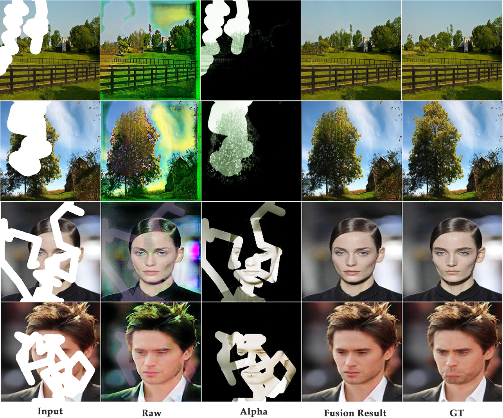

# Deep Fusion Network for Image completion

## Introduction

DFNet introduce **Fusion Block** for generating a flexible alpha composition map to combine known and unknown regions.
It builds a bridge for structural and texture information, so that information in known region can be naturally propagated into completion area.
With this technology, the completion results will have smooth transition near the boundary of completion area.

Furthermore, the architecture of fusion block enable us to apply **multi-scale constraints**.
Multi-scale constrains improves the performance of DFNet a lot on structure consistency.

Moreover, **it is easy to apply this fusion block and multi-scale constrains to other existing deep image completion models**.
A fusion block feed with feature maps and input image, will give you a completion result in the same resolution as given feature maps.

More detail can be found in the [paper](https://arxiv.org/abs/1904.08060)

The illustration of a fusion block in the paper:

<p align="center">
  
</p>

Examples of corresponding images:



If you find this code useful for your research, please cite:

```
@inproceedings{DFNet2019,
  title={Deep Fusion Network for Image Completion},
  author={Xin Hong and Pengfei Xiong and Renhe Ji and Haoqiang Fan},
  journal={arXiv preprint},
  year={2019},
}
```

## Prerequisites

- Python 3
- TensorFlow 2.0
- OpenCV


## Training
+ Clone this repo:
``` bash=
git clone https://github.com/iankuoli/DFNet_TF2.git
cd DFNet/trainer
```
+ Modify the configuration in ```/trainer/```.
+ You can train this model by issuing 
```bash=
python3 task.py
```
We will proceed to build the pre-trained models.

The sample images inferenced by this implelement is shown as follows.

<p align="center">
  
</p>

## More than the paper
We believe the position information is critical for image inpainting.
As a result, we replace the convulution layer by [CoordConv](https://arxiv.org/abs/1807.03247).
Moreover, we also implement the GAN arichitexture with DFNet as a generator and spectral normalization.

## Testing
We have not provided the code for testing or inference.
We believe you can do it :)


## License

<a rel="license" href="http://creativecommons.org/licenses/by-nc/4.0/"></a><br />This work is licensed under a <a rel="license" href="http://creativecommons.org/licenses/by-nc/4.0/">Creative Commons Attribution-NonCommercial 4.0 International License</a>.

